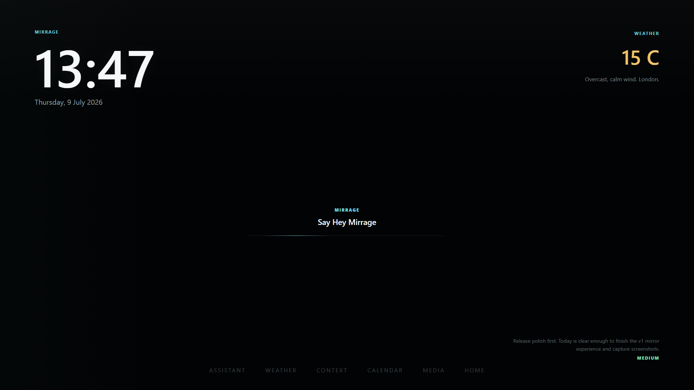

# Mirrage

[](https://github.com/bawan-dev/Mirrage/actions/workflows/ci.yml)

Mirrage is a privacy-first ambient AI assistant for the home, starting with a smart mirror interface.

The project is being built as a serious full-stack system: a mirror-first
frontend, a FastAPI backend, provider-based AI routing, live information
endpoints, Docker deployment, CI, and a documented hardware path for the first
physical build.

## v1 Release Status

Mirrage v1.0.0 is prepared as the first complete portfolio release. The release
focus is the full-stack foundation, ambient mirror experience, demo readiness,
deployment path, and honest hardware plan.

v1 does not claim the physical mirror is assembled yet. It also does not claim a
trained wake-word model, real smart-home devices, Spotify, Calendar, or local AI
are available unless those providers are configured on the machine running it.

## Product Direction

The long-term version is not a cluttered dashboard. The goal is an assistant that stays quiet until it is needed:

```text
Minimal home state
  -> focused assistant / weather / media view
  -> return to home state
```

Planned direction:

- minimal mirror home screen with clock, weather, and subtle system state
- focus views for assistant, weather, media, calendar, and home controls
- local-first AI support where possible
- push-to-talk voice interaction first, with local wake-word runtime support
  being prepared before backend/local speech engines
- explicit demo mode for portfolio screenshots and walkthroughs without mixing
  fake data into production mode
- physical mirror build planned around tested display, mirror material, audio,
  microphone, heat, cable routing, and maintenance choices

Development note: I use AI-assisted development heavily on this project, but I
define the product direction, architecture, roadmap, acceptance criteria, testing
process, and review the implementation as it evolves.

## Current Build

What works now:

- React + TypeScript + Tailwind mirror interface
- premium v1 Mirror Mode polish with sparse typography, lightweight motion, and
  assistant listening/thinking/speaking visual states
- explicit frontend demo mode behind `VITE_MIRRAGE_DEMO_MODE=true`
- FastAPI backend with health, system, voice, weather, assistant, memory, Spotify, Calendar, presence, smart home, and AI runtime routes
- mirror interface connected to backend status data
- weather endpoint using Open-Meteo with a fallback state
- AI runtime with provider routing, task-aware model selection, privacy-aware context prompts, fallback behavior, and `stub`, `ollama`, and `openai` provider options
- browser push-to-talk voice input in the assistant focus view
- speech transcripts sent through the existing assistant endpoint
- browser text-to-speech for assistant replies
- mute and browser voice settings in the assistant focus view
- backend-owned assistant presence engine with Server-Sent Events
- local wake engine boundary with OpenWakeWord provider support, safe
  enable/disable configuration, cooldown handling, and `Hey Mirrage` by default
- local command routing for opening weather, media, assistant, calendar, and context focus views
- Spotify OAuth, currently playing, album artwork, and playback controls
- Google Calendar OAuth, today's schedule, upcoming events, and calendar assistant command
- local SQLite memory layer for preferences, facts, goals, and routines
- assistant memory commands for storing, recalling, and updating local memories
- provider-independent daily context aggregation from weather, calendar, and memory
- provider-independent proactive summary for calm daily nudges
- streaming-shaped assistant endpoint using Server-Sent Events for future token streaming
- Daily Briefing view for daily overview, goals, routines, and suggested focus
- optional Mirror Mode for kiosk-style wall display use, now styled as an ambient glass surface instead of a dashboard
- Docker Compose for running frontend and backend together
- production Docker Compose with restart policies, health checks, persistent data, backups, and logs
- backend structured JSON logging
- startup environment validation
- full health monitoring endpoint for subsystem checks
- local SQLite backup and restore utilities
- backend-owned smart home foundation for Home Assistant discovery, safe light/switch control, scene activation, and read-only sensors
- backend tests, frontend lint/type/build checks, and GitHub Actions CI
- physical build documentation for the first mirror prototype, including
  display, mirror material, compute, audio, microphone, frame, thermal, cable,
  maintenance, cost, assembly, and testing plans

What is still planned:

- trained and hardware-tested local `Hey Mirrage` wake-word model asset
- backend or local speech-to-text option
- backend or local text-to-speech option
- Spotify persistence, device picker, and voice playback commands
- Calendar token persistence and richer schedule actions
- memory editing UI and stronger privacy controls
- AI-enhanced context summaries behind explicit privacy controls
- true provider token streaming
- richer local model profiles for small, summary, planning, and future agent tasks
- richer smart home permissions, confirmations, and device categories
- physical mirror installation and real hardware validation

The default assistant provider is still `stub`. Real model replies require configuring Ollama or an OpenAI-compatible API provider.

## Current Status

| Area | Status |
| --- | --- |
| Mirror UI | v1 ambient mirror interface with polished focus views |
| Mirror Mode | Working behind `VITE_MIRROR_MODE=true` |
| Demo mode | Working behind `VITE_MIRRAGE_DEMO_MODE=true`; fake data is explicit |
| Backend API | Working FastAPI service |
| Assistant | Runtime, provider routing, fallback, and deterministic handlers work; default provider is still `stub` |
| Voice | Browser push-to-talk, browser speech synthesis, and backend presence events |
| Wake word | Local engine boundary and OpenWakeWord provider prepared; real model and microphone testing still required |
| Weather | Live backend weather endpoint with fallback |
| Calendar | Google Calendar OAuth and read-only schedule views |
| Spotify | OAuth, current playback, artwork, and basic controls |
| Memory | Local SQLite preferences, facts, goals, and routines |
| Operations | Production Compose, health checks, logs, startup validation, local backups |
| Proactive assistant | Local rule-based daily nudge from context sources |
| Smart home | Home Assistant foundation with safe domains; real devices require local configuration |
| Hardware | Physical build plan documented; real parts still need testing |
| Vision | Not built yet |

## Screenshots And Demo



| View | Screenshot |
| --- | --- |
| Mirror home | [assets/screenshots/mirror-home.png](assets/screenshots/mirror-home.png) |
| Weather focus | [assets/screenshots/weather-focus.png](assets/screenshots/weather-focus.png) |
| Assistant focus | [assets/screenshots/assistant-focus.png](assets/screenshots/assistant-focus.png) |
| Calendar focus | [assets/screenshots/calendar-focus.png](assets/screenshots/calendar-focus.png) |
| Context focus | [assets/screenshots/context-focus.png](assets/screenshots/context-focus.png) |
| Media focus | [assets/screenshots/media-focus.png](assets/screenshots/media-focus.png) |
| Smart Home focus | [assets/screenshots/smart-home-focus.png](assets/screenshots/smart-home-focus.png) |

Demo video: `TBD`

Demo flow: [docs/demo-guide.md](docs/demo-guide.md)

## Architecture


```text
Mirror Dashboard
      |
      v
FastAPI Backend
      |
      +-- AI Runtime
      |     +-- Context Builder
      |     +-- Provider Router
      |     +-- Local / Cloud Providers
      |
      +-- Local Memory Store
      |
      +-- Personal Context Layer
      |
      +-- Proactive Assistant Layer
      |
      +-- Calendar Integration
      |
      +-- Spotify Integration
      |
      +-- Smart Home Layer
      |
      +-- Local Wake Engine + Presence Layer
      |
      +-- Voice Pipeline
      |
      +-- Health, Logging, Backups
      |
      +-- Physical Build Planning Layer
```

The physical plan treats the mirror as a home appliance: mirror glass, display,
mini PC, microphone, speakers, ventilation, cable routing, and service access
are documented before buying final parts. The frontend renders the mirror
experience. The backend owns API boundaries, service state, assistant routing,
daily context, proactive summaries, local memory, smart home safety rules,
external data, health checks, structured logs, and local backup utilities. The
AI runtime builds a small privacy-aware context, chooses a provider, and falls
back safely if the selected provider is unavailable. AI providers, context
aggregation, memory storage, smart home control, voice input, and hardware
integration stay behind those boundaries so they can change without rewriting
the mirror surface.

More detail:

- [Architecture](docs/architecture.md)
- [AI runtime](docs/ai-runtime.md)
- [API notes](docs/api.md)
- [Backups](docs/backups.md)
- [Calendar setup](docs/calendar.md)
- [Command routing](docs/command-routing.md)
- [Context system](docs/context.md)
- [Deployment](docs/deployment.md)
- [Environment](docs/environment.md)
- [Health monitoring](docs/health-monitoring.md)
- [Logging](docs/logging.md)
- [Memory layer](docs/memory.md)
- [Mirror Mode](docs/mirror-mode.md)
- [Operations](docs/operations.md)
- [Proactive assistant](docs/proactive-assistant.md)
- [Roadmap](docs/roadmap.md)
- [v1 release notes](docs/v1-release.md)
- [Showcase notes](docs/showcase.md)
- [Demo script](docs/demo-script.md)
- [Smart home](docs/smart-home.md)
- [Home Assistant setup](docs/home-assistant.md)
- [Spotify setup](docs/spotify.md)
- [Updates](docs/updates.md)
- [Voice and presence](docs/voice.md)
- [Wake engine](docs/wake-engine.md)
- [Wake word and presence](docs/wake-word-presence.md)
- [OpenWakeWord notes](docs/openwakeword.md)
- [Run notes](docs/run-notes.md)
- [Troubleshooting](docs/troubleshooting.md)
- [Website update notes](docs/website-update-notes.md)

Hardware notes:

- [Build plan](hardware/build-plan.md)
- [Component tracker](hardware/components.md)
- [Wiring notes](hardware/wiring-notes.md)
- [Physical build overview](hardware/physical-build.md)
- [Display selection](hardware/display-selection.md)
- [Mirror material](hardware/mirror-glass.md)
- [Compute options](hardware/compute-options.md)
- [Audio](hardware/audio.md)
- [Microphones](hardware/microphones.md)
- [Thermal design](hardware/thermal-design.md)
- [Cable routing](hardware/cable-routing.md)
- [Frame design](hardware/frame-design.md)
- [Maintenance](hardware/maintenance.md)
- [Shopping list](hardware/shopping-list.md)
- [Cost estimate](hardware/cost-estimate.md)
- [Assembly guide](hardware/assembly-guide.md)
- [Testing checklist](hardware/testing-checklist.md)

## Tech Stack

| Area | Tooling |
| --- | --- |
| Frontend | React, TypeScript, Tailwind CSS, Vite |
| Backend | Python, FastAPI |
| AI | Runtime with provider routing, local/cloud privacy prompts, stub, Ollama, and OpenAI-compatible APIs |
| Weather | Backend Open-Meteo integration with fallback behavior |
| Music | Spotify OAuth and Web API through backend endpoints |
| Calendar | Google Calendar OAuth and read-only events through backend endpoints |
| Voice | Browser speech recognition, browser speech synthesis, and backend presence lifecycle |
| Wake word | Backend wake engine boundary with OpenWakeWord support; real model and mic testing still pending |
| Commands | Frontend intent routing for local UI actions |
| Context | Backend aggregation across weather, Calendar, and local memory |
| Memory | Local SQLite storage for preferences, facts, goals, and routines |
| Proactive | Deterministic backend summary for non-intrusive daily nudges |
| Smart Home | Home Assistant integration through backend safety boundaries |
| Mirror Mode | Frontend kiosk mode behind `VITE_MIRROR_MODE=true` |
| Demo | Explicit frontend demo data behind `VITE_MIRRAGE_DEMO_MODE=true` |
| Deployment | Docker Compose for development and production, systemd examples |
| Operations | Health endpoints, structured logs, startup validation, local backups |
| Hardware Plan | 27 inch display target, two-way mirror material testing, Intel N100 mini PC recommendation |
| Quality | Pytest, Ruff, ESLint, Prettier, TypeScript |
| CI | GitHub Actions |

## Local Development

### Frontend

```powershell
cd frontend
npm install
npm run dev
```

Open:

```text
http://127.0.0.1:5173
```

Mirror Mode is optional:

```powershell
cd frontend
$env:VITE_MIRROR_MODE="true"
npm run dev
```

Details: [docs/mirror-mode.md](docs/mirror-mode.md).

Portfolio demo mode is also optional:

```powershell
cd frontend
$env:VITE_MIRROR_MODE="true"
$env:VITE_MIRRAGE_DEMO_MODE="true"
npm run dev
```

Demo mode uses clearly fake local frontend data for screenshots and walkthroughs.
Turn it off when testing real backend providers.

### Backend

```powershell
.\.venv\Scripts\Activate.ps1
pip install -r backend/requirements.txt
uvicorn backend.app.main:app --reload
```

Open:

```text
http://127.0.0.1:8000/health
```

Expected response:

```json
{"service":"mirrage-api","status":"online"}
```

### Docker

```powershell
docker compose up --build
```

Open:

```text
http://127.0.0.1:5173
http://127.0.0.1:8000/health
```

Stop Docker:

```powershell
Ctrl + C
docker compose down
```

### Production Docker

```powershell
docker compose -f docker-compose.prod.yml up -d --build
```

Check:

```text
http://127.0.0.1:8000/api/health
http://127.0.0.1:8000/api/health/full
http://127.0.0.1:5173/health
```

Production notes: [docs/deployment.md](docs/deployment.md).

## Testing

Current automated checks:

```powershell
# frontend
cd frontend
npm run lint
npm run format:check
npm run type-check
npm run build
```

```powershell
# backend, from repo root
.\.venv\Scripts\Activate.ps1
pip install -r backend/requirements-dev.txt
pytest
```

Current manual checks:

- open `http://127.0.0.1:5173` and confirm the mirror UI loads
- set `VITE_MIRROR_MODE=true`, reload the frontend, and confirm the ambient Mirror Mode home appears
- set `VITE_MIRRAGE_DEMO_MODE=true` only for portfolio walkthroughs and confirm
  demo data appears without needing real OAuth accounts
- confirm Mirror Mode dims after inactivity and returns to home from a focus view after the second timeout
- open `http://127.0.0.1:8000/health` and confirm the backend is online
- open `http://127.0.0.1:8000/api/health/full` and confirm subsystem health checks return without secrets
- check the mirror home shows backend status when the API is running
- check the weather view either shows live data or a clear fallback
- open the assistant focus view, press `Push to talk`, allow microphone access, and confirm the transcript appears
- confirm the voice transcript is sent to `/api/assistant/message` and the assistant reply appears in the assistant view
- confirm assistant replies are spoken aloud when speech output is not muted
- confirm `Mute`, `Test voice`, and the browser voice selector work in the assistant focus view
- open `http://127.0.0.1:8000/api/proactive/summary` and confirm it returns `headline`, `message`, `priority`, `suggestions`, and `should_interrupt`
- open `http://127.0.0.1:8000/api/presence/status` and confirm `state` and `wake_phrase` are present
- open `http://127.0.0.1:8000/api/wake-word/status` and confirm the local wake engine reports disabled, unconfigured, stopped, or running
- open `http://127.0.0.1:8000/api/ai/runtime/status` and confirm runtime settings load without secrets
- open `http://127.0.0.1:8000/api/ai/providers` and confirm `stub`, `ollama`, and `openai` are listed
- post a message to `http://127.0.0.1:8000/api/assistant/stream` and confirm `status`, `chunk`, and `done` events are returned
- post `{ "phrase": "Hey Mirrage" }` to `/api/wake-word/detect` and confirm the state moves to `wake_detected`; repeat during cooldown and confirm duplicates are suppressed
- in Mirror Mode, confirm the lower-right nudge shows a calm daily summary or fallback
- type `What is the weather?` in the assistant view and confirm Weather focus opens
- type `Show my music` in the assistant view and confirm Media focus opens
- type `What is on my calendar today?` and confirm Calendar focus opens with a schedule response
- type `daily briefing` and confirm Context focus opens with a provider-independent proactive briefing
- type `Good morning` or `What needs my attention?` and confirm the assistant replies with `provider: proactive`
- open `http://127.0.0.1:8000/api/context/daily` and confirm weather, calendar, memory, and suggested focus fields exist
- open `http://127.0.0.1:8000/api/smart-home/status` and confirm it returns disabled, unconfigured, unavailable, or connected without exposing tokens
- if Home Assistant is configured, open the Smart Home focus view and confirm supported lights, switches, scenes, and sensors appear
- type `Open assistant` and confirm Assistant focus opens
- type `show my smart home devices` and confirm Smart Home focus opens
- type `remember my favorite drink is coffee` and confirm the assistant replies with `provider: memory`
- type `what do you remember about me?` and confirm the response includes `favorite drink: coffee`
- open `http://127.0.0.1:8000/api/memory/summary` and confirm the memory appears under preferences
- create a local memory backup and confirm a file appears in `backups/`
- configure Spotify credentials, connect through the Media view, and confirm playback state loads
- test Spotify play/pause/next/previous with an active Spotify device
- configure Google Calendar credentials, connect through the Calendar view, and confirm today's events load
- send a message to `/api/assistant/message` and confirm the response shape stays stable
- run `docker compose up --build` when development Docker changes
- run `docker compose -f docker-compose.prod.yml config` when production Docker changes

Browser voice works best in Chrome or Edge because it uses browser speech recognition and speech synthesis. Wake-word audio should be handled by a local engine. This repo now includes the backend wake engine boundary and OpenWakeWord provider support, but not a trained or hardware-tested `Hey Mirrage` model asset.

Spotify playback controls require a connected Spotify account and an active Spotify
device. The first token store is in process memory, so reconnect after backend
restart.

Google Calendar uses a read-only events scope. The first token store is also in
process memory, so reconnect after backend restart.

Smart home control is disabled by default. Home Assistant requires a local base
URL and long-lived access token in `.env`; supported actions are limited to
lights, switches, scenes, and read-only sensors.

Memory records are stored locally in `data/mirrage-memory.sqlite3`. That file is
ignored by Git. Production Docker Compose mounts `./data`, `./backups`, and
`./logs` into the backend container so local memory, backups, and logs can
survive container restarts.

CI runs the core checks on every push and pull request through [.github/workflows/ci.yml](.github/workflows/ci.yml).

## Recruiter / Interview Showcase

Mirrage demonstrates full-stack product engineering across frontend, backend,
AI boundaries, integrations, deployment, operations, and hardware planning. The
interesting part is not one API call; it is the system shape:

- React mirror interface designed for a wall display, not a normal dashboard
- FastAPI backend with service boundaries for AI, memory, weather, Calendar,
  Spotify, smart home, wake-word, health, logging, and backups
- local-first privacy decisions around memory, context, wake-word detection, and
  deterministic assistant commands
- production path with Docker Compose, systemd notes, persistent data, health
  checks, structured logs, and backup utilities
- physical build documentation that covers display, mirror material, compute,
  audio, microphones, heat, frame, cabling, cost, maintenance, and testing

Short interview explanation:

```text
Mirrage is a privacy-first ambient AI mirror platform. I built it as a
full-stack system with a React mirror interface, FastAPI backend, AI runtime,
local memory, presence engine, smart-home boundary, production deployment setup,
and physical hardware build documentation.
```

## Project Structure

```text
mirrage/
  frontend/       mirror interface
  backend/        FastAPI service
  ai/             assistant provider layer
  deploy/         systemd service examples
  data/           local runtime data placeholder
  backups/        local backup placeholder
  logs/           local log placeholder
  docs/           architecture, API, roadmap, run notes
  hardware/       physical build planning
  assets/         screenshots and diagrams
```

## Roadmap Snapshot

Completed foundation work:

- frontend mirror interface
- backend API
- AI provider boundary and runtime
- live weather endpoint and ambient weather view
- Ambient Interaction Layer with focus views
- push-to-talk voice foundation
- browser text-to-speech foundation
- wake-word adapter and presence engine
- local wake engine boundary with OpenWakeWord provider support
- local command routing for focus views
- Spotify media integration
- Google Calendar daily schedule integration
- local memory layer
- personal context system
- mirror mode
- proactive ambient intelligence layer
- ambient intelligence redesign with sparse typography, fewer containers, and refreshed screenshots
- AI runtime with privacy-aware context building, provider routing, fallback, and stream shape
- smart home foundation with Home Assistant discovery, safe action boundaries, health checks, and a small focus view
- Docker development setup
- production Compose, health monitoring, structured logging, local backups, and systemd examples
- tests and CI
- physical mirror build documentation and hardware plan
- v1 premium mirror polish, explicit demo mode, refreshed screenshots, and
  release checklist

Next planned milestone:

- Create the `v1.0.0` Git tag after final review, then test the production stack
  on the target mini PC before buying final mirror parts

Future milestones:

- Wake Word Hardware Validation
- AI Runtime Refinement
- Production Hardening Refinement
- Spotify Refinement
- Calendar Refinement
- Memory Refinement
- Context Refinement
- Smart Home Refinement
- Physical Mirror Assembly
- Home Installation

The full phase breakdown lives in [docs/roadmap.md](docs/roadmap.md).

## v1 Release Checklist

- [x] README updated for v1
- [x] demo guide updated
- [x] screenshots refreshed
- [x] known limitations documented
- [x] automated checks documented
- [ ] GitHub Actions green on the final pushed commit
- [ ] final commit pushed
- [ ] tag created

Suggested release tag:

```powershell
git tag v1.0.0
git push origin v1.0.0
```
