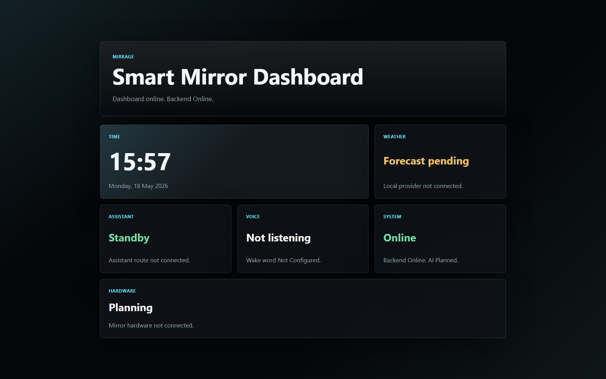

# Mirrage

[](https://github.com/bawan-dev/Mirrage/actions/workflows/ci.yml)

Mirrage is a privacy-first ambient AI assistant for the home, starting with a smart mirror interface.

The project is being built as a serious full-stack system: a mirror-first frontend, a FastAPI backend, provider-based AI routing, live information endpoints, Docker development setup, CI, and hardware planning for a future physical build.

## Product Direction

The long-term version is not a cluttered dashboard. The goal is an assistant that stays quiet until it is needed:

```text
Minimal home state
  -> focused assistant / weather / media view
  -> return to home state
```

Planned direction:

- minimal mirror home screen with clock, weather, and subtle system state
- focus views for assistant, weather, media, calendar, and home controls
- local-first AI support where possible
- push-to-talk voice interaction first, with wake word and spoken replies later
- physical mirror build after the display, material, audio, heat, and wiring choices are tested

## Current Build

What works now:

- React + TypeScript + Tailwind mirror interface
- FastAPI backend with health, system, voice, weather, and assistant routes
- dashboard connected to backend status data
- weather endpoint and card using Open-Meteo with a fallback state
- AI provider boundary with `stub`, `ollama`, and `openai` provider options
- browser push-to-talk voice input in the assistant focus view
- speech transcripts sent through the existing assistant endpoint
- Docker Compose for running frontend and backend together
- backend tests, frontend lint/type/build checks, and GitHub Actions CI
- hardware planning notes for the first mirror prototype

What is still planned:

- wake word support
- backend or local speech-to-text option
- text-to-speech for spoken assistant replies
- Spotify or other music service integration
- calendar integration
- memory/context layer
- smart home control
- physical mirror installation
- production deployment

The default assistant provider is still `stub`. Real model replies require configuring Ollama or an OpenAI-compatible API provider.

## Screenshot



## Architecture


```text
Mirror Dashboard
      |
      v
FastAPI Backend
      |
      +-- AI Service Layer
      |
      +-- Voice Input Layer
      |
      +-- Hardware Planning Layer
```

The frontend renders the mirror experience. The backend owns API boundaries, service state, assistant routing, and external data. AI providers, voice input, and hardware integration stay behind those boundaries so they can change without rewriting the dashboard.

More detail:

- [Architecture](docs/architecture.md)
- [API notes](docs/api.md)
- [Roadmap](docs/roadmap.md)
- [Voice plan](docs/voice.md)
- [Run notes](docs/run-notes.md)
- [Troubleshooting](docs/troubleshooting.md)

Hardware notes:

- [Build plan](hardware/build-plan.md)
- [Component tracker](hardware/components.md)
- [Wiring notes](hardware/wiring-notes.md)

## Tech Stack

| Area | Tooling |
| --- | --- |
| Frontend | React, TypeScript, Tailwind CSS, Vite |
| Backend | Python, FastAPI |
| AI | Provider boundary for stub, Ollama, and OpenAI-compatible APIs |
| Weather | Backend Open-Meteo integration with fallback behavior |
| Voice | Browser push-to-talk speech recognition foundation |
| Dev setup | Docker Compose |
| Quality | Pytest, Ruff, ESLint, Prettier, TypeScript |
| CI | GitHub Actions |

## Local Development

### Frontend

```powershell
cd frontend
npm install
npm run dev
```

Open:

```text
http://127.0.0.1:5173
```

### Backend

```powershell
.\.venv\Scripts\Activate.ps1
pip install -r backend/requirements.txt
uvicorn backend.app.main:app --reload
```

Open:

```text
http://127.0.0.1:8000/health
```

Expected response:

```json
{"service":"mirrage-api","status":"online"}
```

### Docker

```powershell
docker compose up --build
```

Open:

```text
http://127.0.0.1:5173
http://127.0.0.1:8000/health
```

Stop Docker:

```powershell
Ctrl + C
docker compose down
```

## Testing

Current automated checks:

```powershell
# frontend
cd frontend
npm run lint
npm run format:check
npm run type-check
npm run build
```

```powershell
# backend, from repo root
.\.venv\Scripts\Activate.ps1
pip install -r backend/requirements-dev.txt
pytest
```

Current manual checks:

- open `http://127.0.0.1:5173` and confirm the mirror UI loads
- open `http://127.0.0.1:8000/health` and confirm the backend is online
- check the dashboard system card shows backend status when the API is running
- check the weather card either shows live data or a clear fallback
- open the assistant focus view, press `Push to talk`, allow microphone access, and confirm the transcript appears
- confirm the voice transcript is sent to `/api/assistant/message` and the assistant reply appears in the assistant view
- send a message to `/api/assistant/message` and confirm the response shape stays stable
- run `docker compose up --build` when Docker or shared run config changes

Browser voice input works best in Chrome or Edge because it uses the browser speech recognition API. Wake word detection and spoken replies are not built yet.

CI runs the core checks on every push and pull request through [.github/workflows/ci.yml](.github/workflows/ci.yml).

## Project Structure

```text
mirrage/
  frontend/       mirror interface
  backend/        FastAPI service
  ai/             assistant provider layer
  docs/           architecture, API, roadmap, run notes
  hardware/       physical build planning
  assets/         screenshots and diagrams
```

## Roadmap Snapshot

Completed foundation work:

- frontend dashboard
- backend API
- AI provider boundary
- live weather endpoint and dashboard card
- Ambient Interaction Layer with focus views
- push-to-talk voice foundation
- Docker development setup
- tests and CI
- first hardware planning notes

Next planned milestone:

- voice refinement: browser compatibility, clearer error states, and a decision on local/backend speech-to-text

Future milestones:

- Wake Word and Spoken Replies
- Spotify Integration
- Calendar Integration
- Memory Layer
- Smart Home Integration
- Physical Mirror Build
- Home Installation

The full phase breakdown lives in [docs/roadmap.md](docs/roadmap.md).
