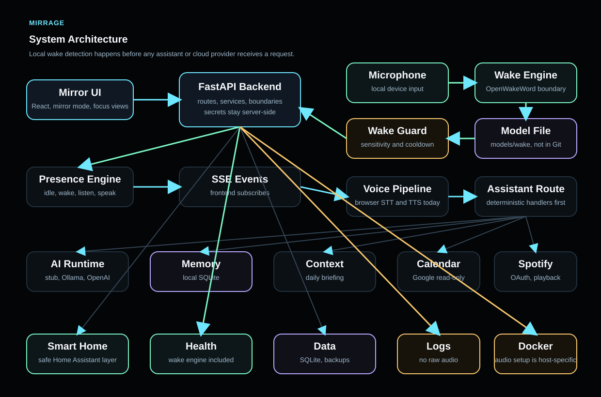

# Architecture

This document explains how Mirrage is planned to fit together.

## System Overview

Mirrage is split into layers instead of one large app. That keeps the dashboard, API, AI logic, voice work, and hardware planning separate enough to build safely over time.



```text
User
  |
  v
Mirror Dashboard
  |
  v
Backend API
  |
  +-- AI Service Layer
  |
  +-- Voice Service
  |
  +-- Hardware Status Layer
```

The frontend should ask for data. The backend should decide where that data comes from. The AI, voice, and hardware layers should stay behind backend boundaries so they can be replaced or upgraded later.

## Folder Responsibilities

### `frontend/`

The frontend will hold the React + Vite smart mirror dashboard.

Its job:

- show the mirror interface
- display time, date, weather, assistant, voice, system, and hardware status
- call backend endpoints when real data is available
- stay focused on presentation and user interaction

The frontend should not directly talk to AI providers, hardware devices, or voice engines.

### `backend/`

The backend will hold the FastAPI service.

Its job:

- expose API endpoints for the dashboard
- return health and system status
- receive assistant messages
- report voice status
- provide clean boundaries for AI, voice, and hardware features

The backend is the main coordination layer.

### `ai/`

The AI layer will hold provider routing and model-related code.

Its job:

- define a common interface for assistant responses
- start with a simple provider stub
- later support providers like Ollama, OpenAI-compatible APIs, or local models
- keep provider details away from the frontend

This lets Mirrage switch model providers without rewriting the dashboard.

### `docs/`

The docs folder explains the project.

Its job:

- describe architecture decisions
- track the roadmap
- document API behavior
- keep project decisions recorded

### `hardware/`

The hardware folder is for the physical mirror build.

Its job:

- document planned parts
- track display, frame, mirror, microphone, and sensor decisions
- keep hardware research separate from software implementation

### `assets/`

The assets folder is for project visuals.

Its job:

- store screenshots
- store diagrams
- store visual material used in docs or the README

## Planned Data Flow

The first real version should follow this path:

```text
React dashboard
  -> FastAPI endpoint
  -> backend service
  -> static or real data source
  -> JSON response
  -> dashboard card
```

Example:

```text
Dashboard voice card
  -> GET /api/voice/status
  -> voice service
  -> returns listening=false, status=planned
  -> frontend displays voice state
```

This keeps the dashboard simple. It asks for state and renders it. The backend owns the details.

## API Boundary

The backend API should start small.

Planned initial endpoints:

| Method | Endpoint | Purpose |
| --- | --- | --- |
| `GET` | `/health` | Check that the backend is running |
| `GET` | `/api/system/status` | Return basic system status |
| `GET` | `/api/voice/status` | Return voice service status |
| `POST` | `/api/assistant/message` | Send a message to the assistant layer |

More endpoints can be added later, but the first version should stay focused.

## AI Boundary

The AI layer should expose one simple idea to the backend:

```text
input message -> assistant response
```

The backend should not care if the response comes from:

- a provider stub
- Ollama
- OpenAI
- another local model runtime

That detail belongs inside `ai/`.

Provider selection starts with `MIRRAGE_AI_PROVIDER`. Today, `stub` is the only supported provider. Later, the AI layer can add providers such as `ollama` or `openai` behind the same backend route.

## Voice Boundary

Voice should start as status only.

Early voice state can include:

- whether the system is listening
- whether wake word detection is configured
- whether speech-to-text is configured
- whether text-to-speech is configured

Actual microphone handling should come later, after the frontend and backend are stable.

The current voice plan is tracked in [voice.md](voice.md).

## Hardware Boundary

Hardware integration should also start as status only.

Early hardware state can include:

- display status
- microphone status
- sensor status
- mirror build status

The physical build should be documented before code depends on it.

## What We Are Avoiding For Now

To keep the project clean, the first stages should avoid:

- direct frontend calls to AI providers
- hardware code before hardware decisions are documented
- voice pipeline work before basic backend endpoints exist
- large abstractions before the project needs them
- treating planned features as finished features

## First Implementation Target

The first working system should be simple:

1. React dashboard loads in the browser.
2. FastAPI backend runs locally.
3. Dashboard calls backend status endpoints.
4. Backend returns initial status data.
5. README and docs clearly explain what is real and what is planned.

That gives Mirrage a real full-stack foundation without pretending the advanced features are finished.
